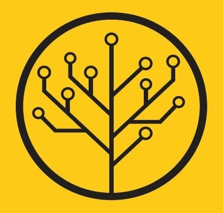

# Courses of Coursera
My files of courses in Coursera

| :sunglasses: | :sunglasses: | :sunglasses: |
|:---:|:---:|:---:|
| |  |   | 
| |  | |

## List of Courses (with links)

1. [x] Майнор ["Интеллектуальный анализ данных"](http://wiki.cs.hse.ru/Заглавная_страница)
    * [x] [Введение в машинное обучение](http://wiki.cs.hse.ru/Майнор_Интеллектуальный_анализ_данных/Введение_в_анализ_данных) | [git]() | [full git](https://github.com/esokolov/ml-minor-hse)
        

            
Course details

            1. Introduction to Numpy, Pandas and Matplotlib
            2. KNN and Linear Regressin (with Huber Loss) from scratch
            3. Random Forest and Gradient Boosting from scratch  
        

        
    * [x] [Современные методы машинного обучения](http://wiki.cs.hse.ru/Майнор_Интеллектуальный_анализ_данных/Современные_методы_машинного_обучения) | [git]() | [full git](https://github.com/hse-ds/iad-deep-learning)
        

            
Course details

            1. Linear Regression with batch-optimization. Logistic Regression from scratch. Mini-batch SGD, SGD with momentum, ADAM from scratch
            2. Introduction to Tensorflow version 1.x. MNIST with accuracy > 97.5
            3. Initialization the weights in CNN. Keras callbacks
            4. Chinese recognition using transfer learning
        

    * [x] [Прикладные задачи анализа данных](http://wiki.cs.hse.ru/Прикладные_задачи_анализа_данных_(майнор_ИАД)) | [git]() | [full git](https://github.com/hse-ds/iad-applied-ds/tree/master/2020)
        

            
Course details

            1. AB-tests.
            2. Introduction to time series with COVID-19. ARIMAX-models
            3. Jigsaw competition in Kaggle. Bi-Directional RNN, BERT, RoBERTa
        

2. [x] [Deep Learning Specialization](https://www.coursera.org/specializations/deep-learning)
    * [x] Neural Networks and Deep Learning | [git]() | [notion]() | [info](https://www.coursera.org/learn/neural-networks-deep-learning?specialization=deep-learning)
    * [x] Improving Deep Neural Networks: Hyperparameter tuning, Regularization and Optimization | [git]() | [notion]() | [info](https://www.coursera.org/learn/deep-neural-network?specialization=deep-learning)
    * [x] Structuring Machine Learning Projects | [git]() | [notion]() | [info](https://www.coursera.org/learn/machine-learning-projects?specialization=deep-learning)
    * [x] Convolutional Neural Networks | [git]() | [notion]() | [info](https://www.coursera.org/learn/convolutional-neural-networks?specialization=deep-learning)
    * [x] Sequence Models | [git]() | [notion]() | [info](https://www.coursera.org/learn/nlp-sequence-models)

3. Yandex
4. [Программирование на Python](https://www.coursera.org/specializations/programming-in-python) от Mail.ru
    * Погружение в Python | [git]() | [info](https://www.coursera.org/learn/diving-in-python)
5. [x] [Introduction to BD]() [git]() | [info](https://www.coursera.org/learn/big-data-introduction)
6. [ ] [Нейронные сети и обработка текста](https://stepik.org/course/54098)
7. [ ] [Машинное обучение и анализ данных](https://www.coursera.org/specializations/machine-learning-data-analysis#courses)
    * [ ] [Математика и Python для анализа данных](https://www.coursera.org/learn/mathematics-and-python?specialization=machine-learning-data-analysis)
    * [ ] [Обучение на размеченных данных](https://www.coursera.org/learn/supervised-learning?specialization=machine-learning-data-analysis)
    * [ ] [Поиск структуры в данных](https://www.coursera.org/learn/unsupervised-learning?specialization=machine-learning-data-analysis)
    * [ ] [Построение выводов по данным](https://www.coursera.org/learn/stats-for-data-analysis?specialization=machine-learning-data-analysis)
    * [ ] [Прикладные задачи анализа данных](https://www.coursera.org/learn/data-analysis-applications)
    * [ ] [Анализ данных: финальный проект](https://www.coursera.org/learn/data-analysis-project)

---

| № | My courses | Status | Rating |
| :---| :---       |     :---:      |  :---: |
| 1. | Deep Learning Specialization | **Finished** | :star::star::star::star::star:  |
| 2. | Нейронные сети и обработка текста  |  In progress   | |
| 3. | Машинное обучение и анализ данных|    In progress    |  |

TODO:
- [x] Add new courses according to courses' schedule
- [ ] Make tables with logo's companies/universities the courses which I passed
- [ ] Add notes from notion
- [ ] Formatings strings (@mentions, #refs, [Useful](https://guides.github.com/pdfs/markdown-cheatsheet-online.pdf), [Emoji](https://gist.github.com/rxaviers/7360908) **formatting**, and <del>tags</del>)
- [ ] Add links to certificates

